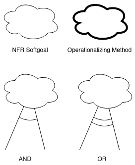
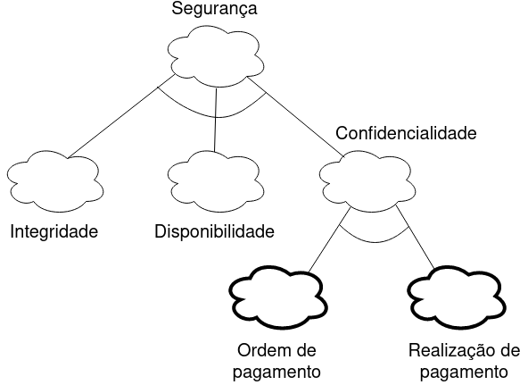
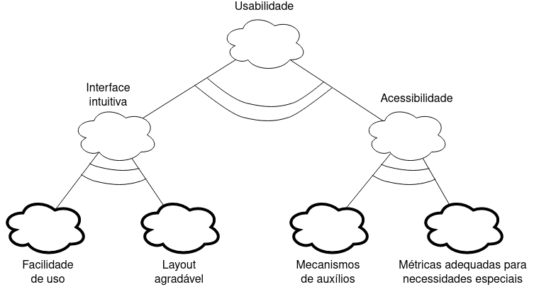

# 
 NFR

#### Histórico de versão 

|    Data    | Versão | Descrição | Autor(es)|
| ---------- | ------ | --------- | -------- |
| 18.08.2021 |   0.1  | Adiciona NFR | Damarcones Porto |
 

### Objetivo do documento

O NFR Framework é uma abordagem orientada a processos, que procura tornar explicitas as metas a serem atingidas para que se obtenha sucesso na implementação de um requisito não funcional. É representado pelo SIG (Softgoal interdependency graph) que descreve como os softgoals são decompostos.
 
Este documento visa apresentar como as necessidades dos requisitos não-funcionais devem ser atendidas para o próprio requisito não-funcional ser alcançado.
  

### Legenda
 

 
<figcaption align='center'>
    <b>Figura 1 - Legenda do NFR. Fonte: autores.</b>
</figcaption>
 

## NFR
### 
**Segurança**
 

 
<figcaption align='center'>
    <b>Figura 2 - NFR de segurança. Fonte: autores.</b>
</figcaption>
  

### 
**Usabilidade**

 
<figcaption align='center'>
    <b>Figura 3 - NFR de usabilidade. Fonte: autores.</b>
</figcaption>
 

### Referências

- Livro: SOMMERVILLE, Ian. **Engenharia de Software**. 9a edição, São Paulo: Pearson, 2011.
