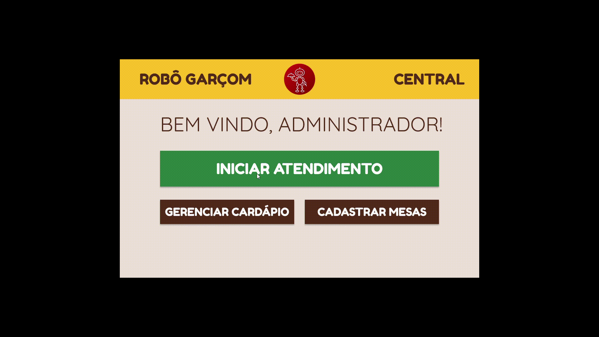

# 
  MANUAL DE USO

#### Histórico de versão 

|      Data      | Versão | Descrição | Autor(es)|
| -------------- | --------- | --------- | -------- |
| 18.10.2021     |    0.1    | Criação e Edição do documento| Bruna Almeida |

### Objetivo do documento

O manual de uso irá ajudar os usuários a entender o funcionamento e a navegabilidade entre telas do aplicativo, através de dois vídeos realizados com os protótipos de alta-fidelidade do cliente e do administrador.
 

## Manual de uso - Cliente

 
<figcaption align='center'>
    <b>Gif 1 - Manual de uso para o cliente. Fonte: Autores.</b>
</figcaption>
 

 

## Manual de uso - Administrador

 
<figcaption align='center'>
    <b>Gif 2 - Manual de uso para o administrador. Fonte: Autores.</b>
</figcaption>
 

