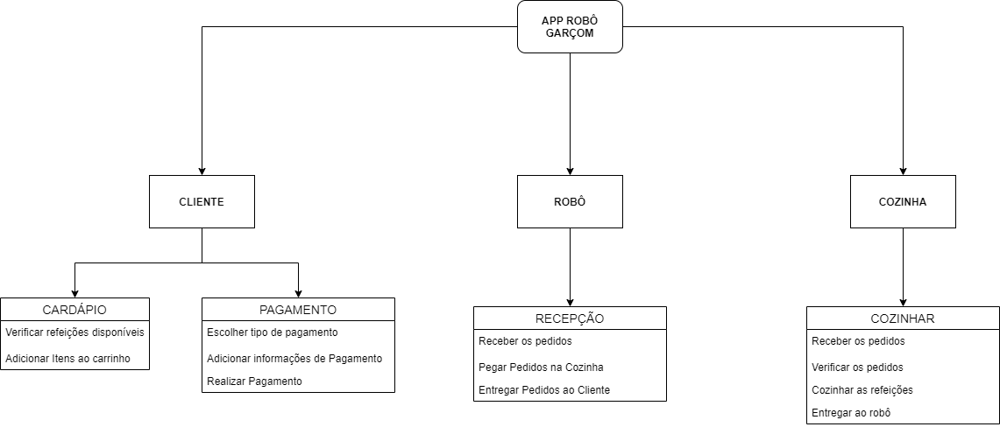

# 
 DIAGRAMA DE ARQUITETURA FUNCIONAL

#### Histórico de versão 

|      Data      | Versão | Descrição | Autor(es)|
| -------------- | --------- | --------- | -------- |
| 13.09.2021 |    0.1    | Criação do Documento de Arquitetura | Letícia Karla Araújo |
 

### Objetivo do documento

Os diagramas de arquitetura de software é a forma de comunicar o planejamento da construição de um sistema de software ou como um sistema de software existente funciona. Ele facilita o entendimento da arquitetura adotada, é recurso gráfico didátivo, principalmente para os clientes do projeto. Onde é possível explicar vários aspectos do projeto de maneira direta e visual. O Diagrama de Arquitetura podem explicar, também, o Processo Projetual. 

 

## Diagrama de arquitetura funcional
 

</ 
<figcaption align='center'>
    <b>Figura 1 - Diagrama de Arquitetura desenvolvido para o projeto Robô Garçom. Fonte: autores.</b>
</figcaption>
 

  
### Referências

- BALOSIN, Ionut. **Por que precisamos de diagramas de arquitetura?**. Disponível em:[infoq.com/br/articles/why-architectural-diagrams/](https://www.infoq.com/br/articles/why-architectural-diagrams/). Acesso em 13 de setembro de 2021.

- PUC - PR. **Quais são os tipos de arquitetura de software e como escolher o melhor para seu projeto**. Disponível em: [posdigital.pucpr.br/blog/tipos-de-arquitetura-de-software](https://posdigital.pucpr.br/blog/tipos-de-arquitetura-de-software). Acesso em 13 de setembro de 2021.

- SOPHIA, Ana. **Diagramas De Arquitetura**. 2020. Disponível em: [edrawsoft.com/pt/architecture-diagram.html](https://www.edrawsoft.com/pt/architecture-diagram.html). Acesso em 13 de setembro de 2021.