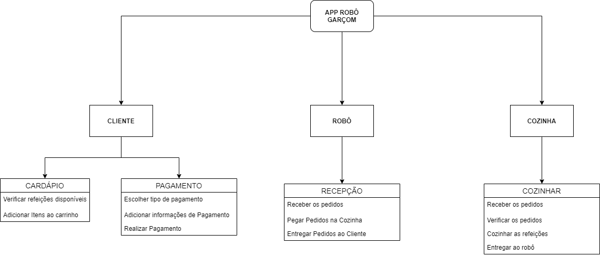

# 
 DIAGRAMA DE ARQUITETURA FUNCIONAL

#### Histórico de versão 

|      Data      | Versão | Descrição | Autor(es)|
| -------------- | --------- | --------- | -------- |
| 13.09.2021 |    0.1    | Criação do Documento de Arquitetura | Letícia Karla Araújo |

### Objetivo do documento

Os diagramas de arquitetura de software é a forma de comunicar o planejamento da construição de um sistema de software ou como um sistema de software existente funciona. Ele facilita o entendimento da arquitetura adotada, é recurso gráfico didátivo, principalmente para os clientes do projeto. Onde é possível explicar vários aspectos do projeto de maneira direta e visual. O Diagrama de Arquitetura podem explicar, também, o Processo Projetual.

## Diagrama de arquitetura funcional

 

 Figura 1: Diagrama de Arquitetura elaborado pelo Grupo 4 de PI2.

  
## Referências
- BALOSIN, Ionut. Por que precisamos de diagramas de arquitetura? Disponível em: https://www.infoq.com/br/articles/why-architectural-diagrams/. Acesso em: 13 set. 2021.
- PUC - PR. Quais são os tipos de arquitetura de software e como escolher o melhor para seu projeto: um bom arquiteto de software precisa conhecer padrões para desenvolver um projeto de sucesso. conheça os principais tipos de arquitetura de software.. Um bom arquiteto de software precisa conhecer padrões para desenvolver um projeto de sucesso. Conheça os principais tipos de arquitetura de software.. Disponível em: https://posdigital.pucpr.br/blog/tipos-de-arquitetura-de-software. Acesso em: 13 set. 2021.
- SOPHIA, Ana. Diagramas De Arquitetura. 2020. Disponível em: https://www.edrawsoft.com/pt/architecture-diagram.html. Acesso em: 13 set. 2021.
