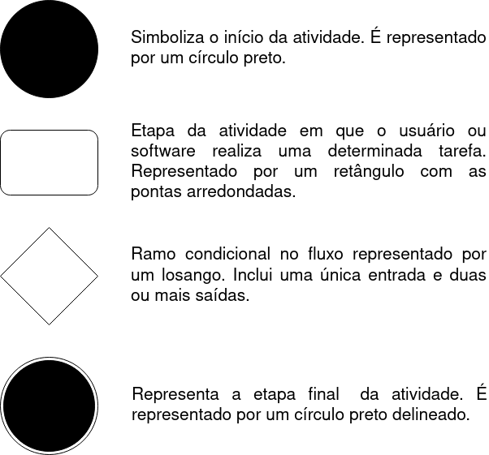

# 
 DIAGRAMAS DE ATIVIDADES

#### Histórico de versão 

|      Data      | Versão | Descrição | Autor(es)|
| -------------- | --------- | --------- | -------- |
| 06.09.2021     |    0.1    | Criação do documento| Bruna, Damarcones |

 

### Objetivo do documento

O objetivo do diagrama de atividades é mostrar o fluxo de atividades em um único processo. O diagrama mostra como uma atividade depende da outra.
 

 
<figcaption align='center'>
    <b>Figura 1 - Legenda.</b>
</figcaption>
 

 

## Diagrama de atividades
 

</ 
<figcaption align='center'>
    <b>Figura 1 - Diagrama de atividade de realização de pedido desenvolvido para o projeto Robô Garçom. Fonte: autores.</b>
</figcaption>
 

 

### Referências
- LUCIDCHART, **O que é diagrama de atividades UML?**. Disponível em: [lucidchart.com/pages/pt/o-que-e-diagrama-de-atividades-uml](https://www.lucidchart.com/pages/pt/o-que-e-diagrama-de-atividades-uml). Acesso em 26 de abril de 2021.

- UFMG, **Diagrama de Atividades**. Disponível em: [homepages.dcc.ufmg.br/~amendes/GlossarioUML/glossario/conteudo/atividades/diagrama_de_atividades.htm](https://homepages.dcc.ufmg.br/~amendes/GlossarioUML/glossario/conteudo/atividades/diagrama_de_atividades.htm). Acesso em 26 de abril de 2021.

- DSC, **Diagrama de Atividades**. Disponível em: [dsc.ufcg.edu.br/~jacques/cursos/map/html/uml/diagramas/atividades/diag_atividades.htm](http://www.dsc.ufcg.edu.br/~jacques/cursos/map/html/uml/diagramas/atividades/diag_atividades.htm). Acesso em 26 de abril de 2021.

- Todos os diagramas foram desenvolvidos na plataforma [Draw.io](https://app.diagrams.net/).
