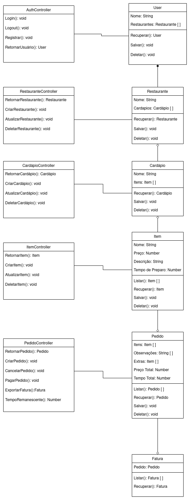

# 
 DIAGRAMA DE CLASSES

#### Histórico de versão 

|      Data      | Versão | Descrição | Autor(es)|
| -------------- | --------- | --------- | -------- |
| 05.09.2021 |    0.1    | Adiciona Diagrama de Classes | Samuel Barros Borges |

 

### Objetivo do documento

O diagrama de classes tem como objetivo especificar os diferentes componentes de um software e como eles se interligam, do ponto de vista estrutural.
 

 

## Diagrama de classes

### Referências
- VENTURA, Plínio. **Entendendo o Diagrama de Classes da UML.** Modelo de Classes com UML. 2018. Disponível em: https://www.ateomomento.com.br/uml-diagrama-de-classes/. Acesso em: 05 set. 2021.
