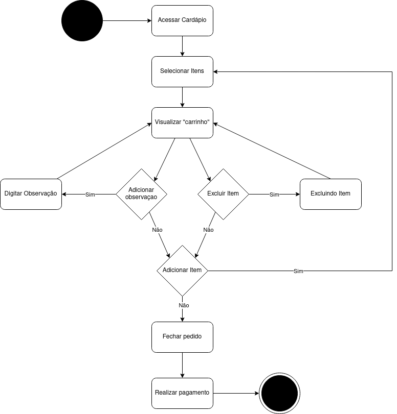

# 
 DIAGRAMAS DE COMPONENTES

#### Histórico de versão 

|    Data    | Versão | Descrição | Autor(es)|
| ---------- | ------ | --------- | -------- |
| 16.09.2021 |  0.1   | Criação do documento e adiciona objetivo| Bruna Almeida |
| 17.09.2021 |  0.2   |Adiciona diagrama de componentes| Damarcones Porto |

 

### Objetivo do documento

O diagrama de componentes mostra o relacionamento entre diferentes componentes de um sistema. O termo "componente" refere-se a um módulo de classes que representa sistemas ou subsistemas independentes com capacidade de interagir com o restante do sistema.
 
O diagrama de componentes em UML dá uma visão geral do sistema de software. Compreender o comportamento exato do serviço fornecido por cada software fará de você um desenvolvedor melhor. O diagrama de componentes descreve sistemas de software implementados em qualquer linguagem ou estilo de programação. Através dele, a equipe de desenvolvimento pode: imaginar a estrutura lógica do sistema; prestar atenção aos componentes do sistema e como eles se relacionam; e enfatizar o comportamento do serviço quanto à interface.
 

## Diagrama de componentes
<!--  

</ 
<figcaption align='center'>
    <b>Figura 1 - Diagrama de componentes de realização de pedido desenvolvido para o projeto Robô Garçom. Fonte: autores.</b>
</figcaption>
 
 
 -->

### Referências
- LUCIDCHART, **Diagrama de componentes UML: o que é, como fazer e exemplos**. Disponível em: [lucidchart.com/pages/pt/diagrama-de-componentes-uml](https://www.lucidchart.com/pages/pt/diagrama-de-componentes-uml). Acesso em 17 de setembro de 2021.