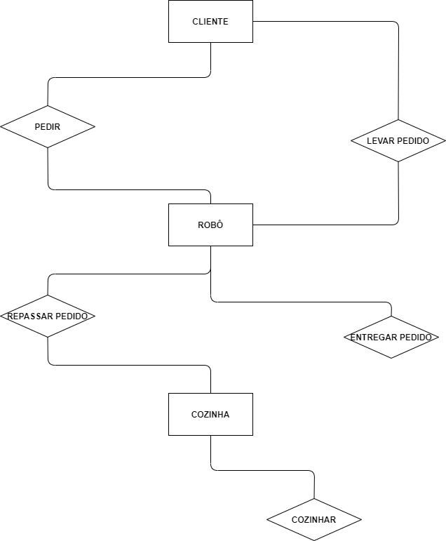

# 
 DIAGRAMA ENTIDADE-RELACIONAMENTO

#### Histórico de versão 

|      Data      | Versão | Descrição | Autor(es)|
| -------------- | --------- | --------- | -------- |
| 13.09.2021 |    0.1    | Criação do Documento | Letícia Karla Araújo |
 

### Objetivo do documento
  
Um modelo ER é uma modelo sistemático para descrever e definir um processo de negócio. O processo é modelado como componentes em forma de entidades que são ligadas umas as outras por relacionamentos que expressam as dependências e exigências entre elas. Como por exemplo, um edifício pode ser dividido em zero ou mais apartamentos, mas um apartamento pode estar localizado em apenas um edifício. Entidades podem ter várias propriedades ou atributos que as caracterizam. Os diagramas existem para fazer a representação grafica dessas entidades, atributos e relacionamentos.

## Diagrama entidade-relacionamento
  

 

### Referências
- GAMA BOYLE LAB (Brasília). DIAGRAMA DE ENTIDADE RELACIONAMENTO. Disponível em: https://damarcones.github.io/Gama_Boyle_Lab/diagramas/diagrama-entidade/. Acesso em: 13 set. 2021.
- DEVMEDIA (Brasil). Modelo Entidade Relacionamento (MER) e Diagrama Entidade: relacionamento (der). Relacionamento (DER). Disponível em: https://www.devmedia.com.br/modelo-entidade-relacionamento-mer-e-diagrama-entidade-relacionamento-der/14332. Acesso em: 13 set. 2021.
- LUCIDCHART (Brasil). O que é um diagrama entidade relacionamento? Disponível em: https://www.lucidchart.com/pages/pt/o-que-e-diagrama-entidade-relacionamento. Acesso em: 13 set. 2021.
