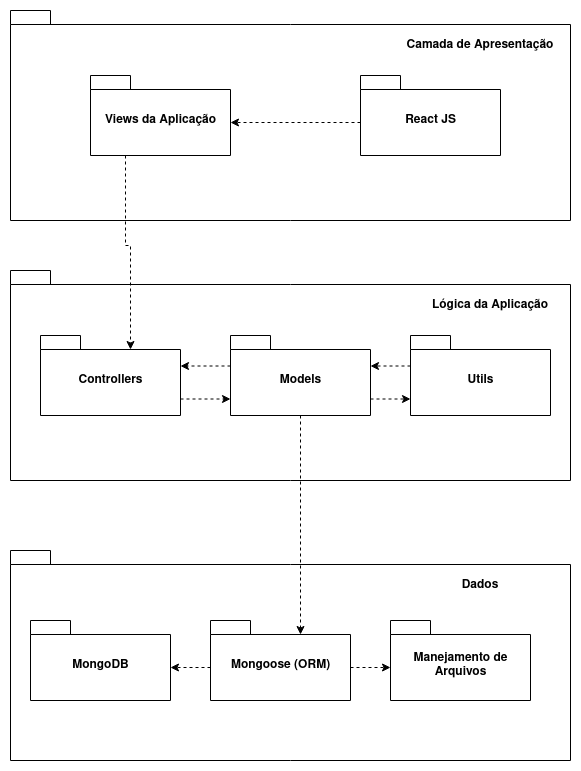

# 
 DIAGRAMA DE PACOTES

#### Histórico de versão 

| Data       | Versão | Descrição                    | Autor(es)     |
| ---------- | ------ | ---------------------------- | ------------- |
| 06.09.2021 | 0.1    | Adiciona Diagrama de Pacotes | Samuel Borges |

 

### Objetivo do documento

O diagrama de pacotes é um diagrama estrutural usado para mostrar a organização e disposição dos diversos elementos e camadas de um determinado sistema.
 

 

## Diagrama de pacotes

### Referências

- TUDO sobre diagramas de pacotes UML. **Lucidchart**. Disponível em: https://www.lucidchart.com/pages/pt/diagrama-de-pacotes-uml. Acesso em 06 set. 2021.

