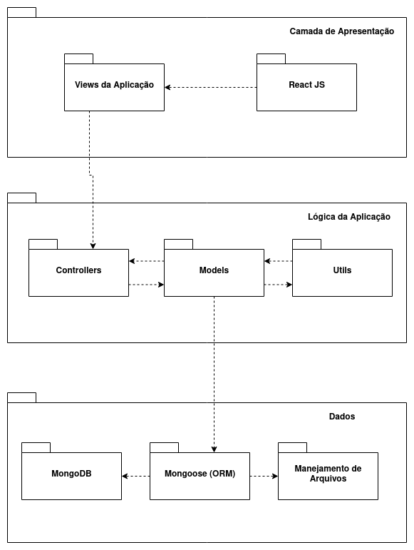

# 
 DIAGRAMA DE PACOTES

#### Histórico de versão 

| Data       | Versão | Descrição                    | Autor(es)     |
| ---------- | ------ | ---------------------------- | ------------- |
| 06.09.2021 | 0.1    | Adiciona Diagrama de Pacotes | Samuel Borges |
 

### Objetivo do documento

O diagrama de pacotes é um diagrama estrutural usado para mostrar a organização e disposição dos diversos elementos e camadas de um determinado sistema.
  

## Diagrama de pacotes
 

</ 
<figcaption align='center'>
    <b>Figura 1 - Diagrama de de pacotes desenvolvido para o projeto Robô Garçom. Fonte: autores.</b>
</figcaption>
 

### Referências

- TUDO sobre diagramas de pacotes UML. **Lucidchart**. Disponível em: [lucidchart.com/pages/pt/diagrama-de-pacotes-uml](https://www.lucidchart.com/pages/pt/diagrama-de-pacotes-uml). Acesso em 06 de setembro de 2021.