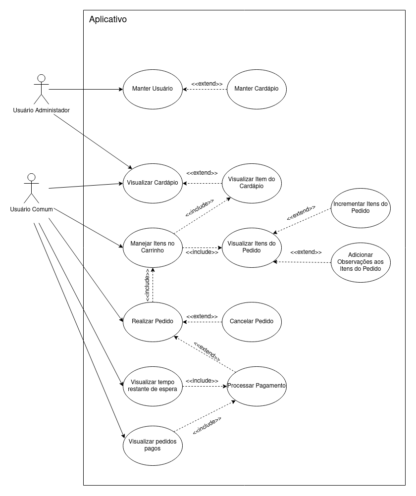

# 
 DIAGRAMA DE CASOS DE USO

#### Histórico de versão 

|    Data    | Versão | Descrição | Autor(es)|
| ---------- | ------ | --------- | -------- |
| 00.08.2021 |   0.1  | Adiciona Diagrama de Casos de Uso | Samuel Borges |

 

### Objetivo do documento

O objetivo deste documento é ilustrar os casos de uso da aplicação Robô Garçom e
explicitar seus relacionamentos. Sendo estes relacionamentos entre dois casos de uso, ou entre casos de uso e seus autores.
  

## Diagrama de casos de uso
 

</ 
<figcaption align='center'>
    <b>Figura 1 - Diagrama de casos de uso desenvolvido para o projeto Robô Garçom. Fonte: autores.</b>
</figcaption>
 
