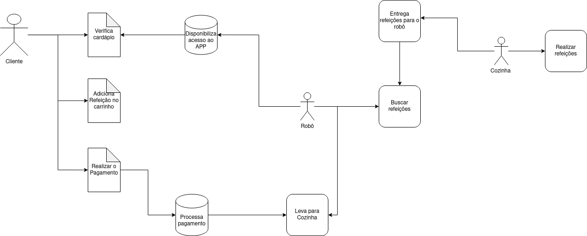

# 
 RICH PICTURES

#### Histórico de versão 

|    Data    | Versão | Descrição | Autor(es)|
| ---------- | ------ | --------- | -------- |
| 17.08.2021 |   0.1  |Criação do documento|Damarcones Porto|
| 17.08.2021 |   0.2  |Adiciona objetivo|Bruna Almeida|
| 17.08.2021 |   0.3  |Adiciona imagens|Damarcones Porto|
 

### Objetivo do documento

Um Rich Picture é um desenho de uma situação que ilustra os principais elementos e relações que precisam ser considerados em um software, a fim de criar alguma melhoria. O objetivo do Rich Picture é compreender a complexidade de uma situação e se baseia na ideia de que "uma imagem diz mil palavras". Ela também se baseia no fato de que nossa consciência intuitiva se comunica mais facilmente em impressões e símbolos do que em palavras.
 

Uma imagem rica nos ajuda a ver relacionamentos e conexões que, de outra forma, poderíamos perder. Ela ajuda a identificar um ou mais temas que os usuários podem querer explorar e abordar mais.
 

O rich picture desenvolvido pela integrante da equipe Letícia Karla descreve os possíveis passo a passo do sistema envolvendo o <b>robô garçom</b> e a dinâmica do restaurante.
  

## Rich Picture

 
<figcaption align='center'>
    <b>Figura 1 - Rich Picture do sistema robô garçom.</b>
</figcaption>
 

### Referências

- Multi-Stakeholder Partnerships, <b>Rich Picture</b>. Disponível em: <a href="http://www.mspguide.org/tool/rich-picture">mspguide.org/tool/rich-picture</a>. Acesso em 17 de agosto de 2021.

