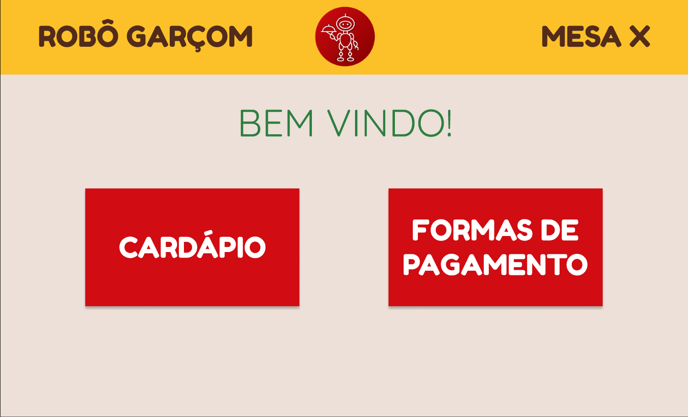

# 
 PROTÓTIPO DE ALTA FIDELIDADE

#### Histórico de versão 

|    Data    | Versão | Descrição | Autor(es)|
| ---------- | ------ | --------- | -------- |
| 24.08.2021 |   0.1  |Criação do documento|Bruna Almeida|
| 24.08.2021 |0.2|Desenvolvimento do protótipo|Bruna Almeida e Damarcones Porto|
| 24.08.2021 |0.3|Adiciona link para o Figma|Bruna Almeida|
 

### Objetivo do documento

O objetivo da criação do protótipo de alta fidelidade é a apresentação das telas da forma mais próxima possível com o produto final. Esse processo permite o debate sobre detalhes aprofundados no momento das tomadas de decisão a respeito do design do software e a identificação de possíveis problemas de usabilidade, com base nas interações dos potenciais usuários do sistema. A prototipagem é uma das maneiras de construir a arquitetura da informação de um software, cujo objetivo é tornar eficaz a interação entre o usuário e a interface do qual ele esta interagindo. 
 
O protótipo de alta fidelidade foi desenvolvido na plataforma <a href="https://www.figma.com/">Figma</a>, pelos intregrantes da equipe Bruna Almeida e Damarcones Porto. O software <a href="https://www.figma.com/">Figma</a> foi escolhido devido a facilidade na utilização da ferramenta e pela diversidade de funcionalidades presentes no mesmo. O protótipo tem como objetivo abranger, além da interface do produto em termos visuais e estéticos, os aspectos da experiência do usuário em termos de interações, fluxo e comportamento. 
  

## Protótipo de alta fidelidade

Clique na imagem abaixo para acessar o protótipo de alta fidelidade.  

<!-- [=400x](https://www.figma.com/proto/Jvr7amlb2WSsB8yJstr53r/PI2-Prot%C3%B3tipo_alta_fidelidade?node-id=12%3A3&scaling=min-zoom&page-id=0%3A1&starting-point-node-id=12%3A3) -->

 
### Referências

- WIKIPÉDIA, <b>Arquitetura de informação</b>, dispnível em: <a href="https://pt.wikipedia.org/wiki/Arquitetura_de_informa%C3%A7%C3%A3o#Objetivo_da_Arquitetura_da_Informa%C3%A7%C3%A3o">wikipedia.org/wiki/Arquitetura_de_informacao</a>. Acesso em 24 de agosto de 2021.
- GITHUB, <b>Gama Boyle Lab: Protótipo de alta fidelidade</b>, dispnível em: <a href="https://damarcones.github.io/Gama_Boyle_Lab/ihc/prototipo-alta/">github.io/Gama_Boyle_Lab/ihc/prototipo-alta/</a>. Acesso em 24 de agosto de 2021.

<!-- \begin{itemize}
  \item \textbf{UC01 Manter Usuário do Restaurante}
    \begin{itemize}
      \item{ \textbf{Ator:} Dono/Gerente do Restaurante}
      \item{\textbf{Descrição:} Permite que o usuário faça cadastro, visualize, edite e delete o seu perfil como administrador do restaurante.}
      \item{\textbf{Pré-condições:} Usuário deve ter um dispositivo com acesso ao aplicativo e entrar em contato com a equipe responsável pelo serviço do Robô garçom.}
      \item{\textbf{Pós-condições:} Qualquer alteração feita pelo usuário deve ser salva no sistema.}
      \item{\textbf{Fluxo normal:}
        \begin{enumerate}
          \item O usuário administrador entra no aplicativo e realiza login;
          \item O usuário administrador entra na tela do perfil;
          \item O usuário administrador edita as informações ali presentes;
          \item O usuário administrador salva o perfil e retorna à pagina inicial.
        \end{enumerate}
      }
    \end{itemize}
    
  \item \textbf{UC02 Manter Cardápio do Restaurante}
    \begin{itemize}
      \item{ \textbf{Ator:} Usuário Comum}
      \item{\textbf{Descrição:} Permite que o Usuário comum visualize o cardápio do restaurante em que se encontra.}
      \item{\textbf{Pré-condições:} O usuário administrador deve ter uma conta no sistema e um aparelho com acesso ao sistema.}
      \item{\textbf{Pós-condições:} Qualquer alteração feita ao cardápio do restaurante deve ser salva no sistema.}
      \item{\textbf{Fluxo normal:}
        \begin{enumerate}
          \item O usuário administrador entra no aplicativo e realiza login;
          \item O usuário administrador entra na tela do cardápio do restaurante;
          \item O usuário administrador edita as informações dobre o cardápio;
          \item O usuário administrador salva o cardápio e retorna à tela inicial.
        \end{enumerate}
      }
    \end{itemize}
    
  \item \textbf{UC03 Visualizar o Cardápio}
     \begin{itemize}
      \item{ \textbf{Ator:} Usuário Comum}
      \item{\textbf{Descrição:} Permite que o Usuário comum visualize o cardápio do restaurante em que se encontra.}
      \item{\textbf{Pré-condições:} O usuário deve ter um aparelho com acesso ao aplicativo.}
      \item{\textbf{Pós-condições:} O usuário deve conseguir ver na tela de seu aparelho o cardápio do restaurante em que se encontra.}
      \item{\textbf{Fluxo normal:}
        \begin{enumerate}
          \item O usuário entra no sistema e busca o cardápio do restaurante em que se encontra;
          \item O usuário visualiza o cardápio do restaurante.
        \end{enumerate}
      }
    \end{itemize}
    
  \item \textbf{UC04 Visualizar Item do Cardápio}
    \begin{itemize}
      \item{ \textbf{Ator:} Usuário Comum}
      \item{\textbf{Descrição:} Permite que o usuário comum veja detalhes sobre cada item no cardápio.}
      \item{\textbf{Pré-condições:} O usuário precisa estar visualizando o cardápio do restaurante.}
      \item{\textbf{Pós-condições:} O usuário consegue ver na tela de seu aparelho os detalhes sobre um item específico do cardápio.}
      \item{\textbf{Fluxo normal:}
        \begin{enumerate}
          \item O usuário visualiza o cardápio do restaurante em que se encontra;
          \item O usuário seleciona o item que deseja detalhar e aciona a opção "Mais Detalhes";
          \item O usuário vê os detalhes do item escolhido.
        \end{enumerate}
      }
    \end{itemize}
    
  \item \textbf{UC05 Manejar Itens no Carrinho}
    \begin{itemize}
      \item{ \textbf{Ator:} Usuário Comum}
      \item{\textbf{Descrição:} Permite que o usuário comum adicione, edite e remova itens do seu carrinho.}
      \item{\textbf{Pré-condições:} O usuário precisa ter acesso ao cardápio do restaurante.}
      \item{\textbf{Pós-condições:} Qualquer adição, edição ou remoção de itens no carrinho precisa ser salva no sistema.}
      \item{\textbf{Fluxo normal:}
        \begin{enumerate}
          \item O usuário visualiza os itens do cardápio do restaurante em que se encontra;
          \item O usuário adiciona os itens que quer no seu carrinho;
          \item O usuário edita ou remove qualquer item no seu carrinho;
          \item O usuário finaliza o pedido.
        \end{enumerate}
      }
    \end{itemize}
    
  \item \textbf{UC06 Adicionar observações aos Itens do Pedido}
    \begin{itemize}
      \item{ \textbf{Ator:} Usuário Comum}
      \item{\textbf{Descrição:} Permite que o usuário comum adicione, edite e remova observações sobre cada item do seu pedido.}
      \item{\textbf{Pré-condições:} O usuário precisa ter itens adicionados ao seu carrinho.}
      \item{\textbf{Pós-condições:} As observações de cada item são salvas no sistema.}
      \item{\textbf{Fluxo normal:}
        \begin{enumerate}
          \item O usuário adiciona um item ao seu carrinho;
          \item O usuário pode adicionar uma observação a esse item;
          \item O usuário salva a observação para esse item.
        \end{enumerate}
      }
    \end{itemize}
    
  \item \textbf{UC07 Incrementar Itens do Pedido}
    \begin{itemize}
      \item{ \textbf{Ator:} Usuário Comum}
      \item{\textbf{Descrição:} Permite que o usuário comum incremente cada item do seu pedido com ingredientes extras.}
      \item{\textbf{Pré-condições:} O usuário precisa ter itens adicionados ao seu carrinho.}
      \item{\textbf{Pós-condições:} Os ingredientes extras de cada item são salvas no sistema.}
      \item{\textbf{Fluxo normal:}
        \begin{enumerate}
          \item O usuário adiciona um item ao seu carrinho;
          \item O usuário pode adicionar ingredientes extras a esse item;
          \item O usuário salva os ingredientes extras para esse item.
        \end{enumerate}
      }
    \end{itemize}
    
  \item \textbf{UC08 Visualizar Itens do Pedido}
    \begin{itemize}
      \item{ \textbf{Ator:} Usuário Comum}
      \item{\textbf{Descrição:} Permite que o usuário comum visualize todos os itens do seu pedido antes da realização do pagamento.}
      \item{\textbf{Pré-condições:} O usuário precisa ter itens adicionados ao seu carrinho.}
      \item{\textbf{Pós-condições:} A lista de itens que o usuário adicionou em seu carrinho vão ser exibidas na tela do aparelho.}
      \item{\textbf{Fluxo normal:}
        \begin{enumerate}
          \item O usuário adiciona um ou mais itens ao seu carrinho;
          \item O usuário vê os itens que adicionou ao carrinho.
        \end{enumerate}
      }
    \end{itemize}
    
  \item \textbf{UC09 Realizar Pedido}
    \begin{itemize}
      \item{ \textbf{Ator:} Usuário comum}
      \item{\textbf{Descrição:} Permite que o usuário envie o seu pedido para ser preparado pelo restaurante.}
      \item{\textbf{Pré-condições:} O usuário precisa ter itens adicionados ao seu carrinho.}
      \item{\textbf{Pós-condições:} O usuário é encaminhado para a tela de pagamento.}
      \item{\textbf{Fluxo normal:}
        \begin{enumerate}
          \item O usuário adiciona um ou mais itens ao seu carrinho;
          \item O usuário vê os itens que adicionou ao carrinho;
          \item O usuário confirma os itens que estão no carrinho;
          \item O usuário é encaminhado para a tela de pagamento.
        \end{enumerate}
      }
    \end{itemize}
    
  \item \textbf{UC10 Cancelar Pedido}
    \begin{itemize}
      \item{ \textbf{Ator:} Usuário Comum}
      \item{\textbf{Descrição:} Permite que o usuário cancele um pedido antes de realizar o pagamento.}
      \item{\textbf{Pré-condições:} O Usuário precisa ter feito um pedido.}
      \item{\textbf{Pós-condições:} O pedido é cancelado.}
      \item{\textbf{Fluxo normal:}
        \begin{enumerate}
          \item O usuário faz um pedido e é encaminhado para a tela de pagamento;
          \item O usuário cancela o pedido;
          \item O usuário é encaminhado para a tela do cardápio.
        \end{enumerate}
      }
    \end{itemize}
    
  \item \textbf{UC11 Processar Pagamento}
    \begin{itemize}
      \item{ \textbf{Ator:} Usuário Comum}
      \item{\textbf{Descrição:} Permite que o usuário escolha o método de pagamento e realize o pagamento.}
      \item{\textbf{Pré-condições:} O Usuário precisa ter feito um pedido.}
      \item{\textbf{Pós-condições:} O pedido é pago e enviado para o preparo pelo restaurante.}
      \item{\textbf{Fluxo normal:}
        \begin{enumerate}
          \item O usuário faz um pedido e é encaminhado para a tela de pagamento;
          \item O usuário realiza o pagamento do pedido;
          \item O pedido é enviado para o preparo pelo restaurante.
        \end{enumerate}
      }
    \end{itemize}
    
  \item \textbf{UC12 Visualizar pedidos pagos}
    \begin{itemize}
      \item{ \textbf{Ator:} Usuário Comum}
      \item{\textbf{Descrição:} Permite que o usuário comum veja seus pedidos pagos e exporte o comprovante do pagamento de um pedido feito anteriormente.}
      \item{\textbf{Pré-condições:} O usuário precisa ter realizado o pagamento de um pedido.}
      \item{\textbf{Pós-condições:} O comprovante do pedido é gerado e exportado.}
      \item{\textbf{Fluxo normal:}
        \begin{enumerate}
          \item O usuário realiza o pagamento do pedido;
          \item O pedido é enviado para o preparo pelo restaurante;
          \item O usuário navega para a tela de pedidos pagos;
          \item O usuário vê os detalhes de um pedido específico e exporta o comprovante de pagamento.
        \end{enumerate}
      }
    \end{itemize}
    
  \item \textbf{UC13 Visualizar tempo restante de espera}
    \begin{itemize}
      \item{ \textbf{Ator:} Usuário Comum}
      \item{\textbf{Descrição:} Permite que o usuário comum visualize o tempo restante estimado para a entrega do seu pedido.}
      \item{\textbf{Pré-condições:} O usuário precisa ter feito e pago um pedido.}
      \item{\textbf{Pós-condições:} O usuário vê o tempo restante estimado para a entrega do pedido.}
      \item{\textbf{Fluxo normal:}
        \begin{enumerate}
          \item O usuário realiza o pagamento do pedido;
          \item O pedido é enviado para o preparo pelo restaurante;
          \item O usuário vê o tempo restante estimado para a entrega do pedido.
        \end{enumerate}
      }
    \end{itemize}
\end{itemize} -->
