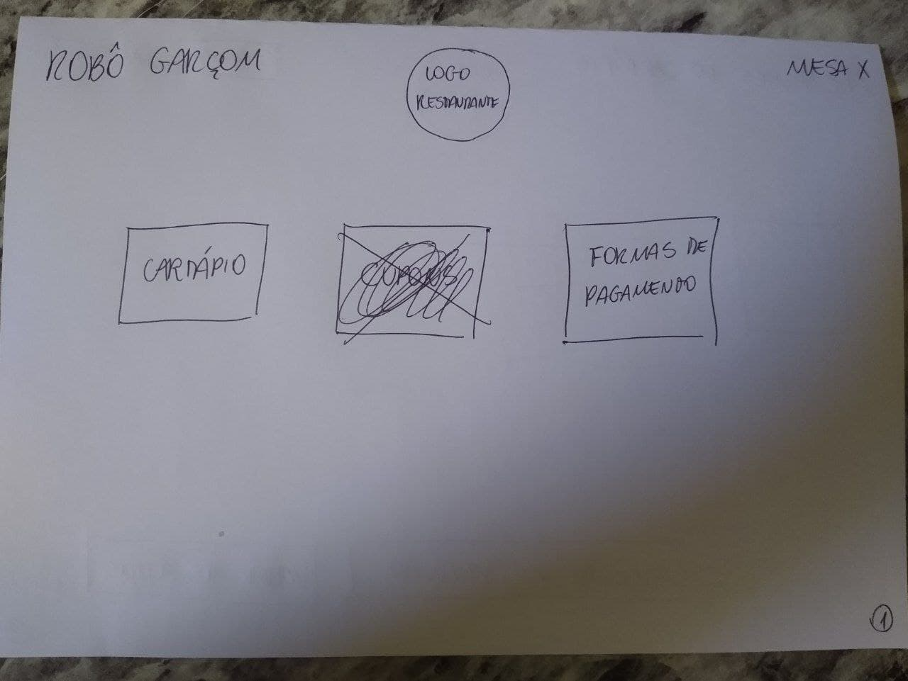
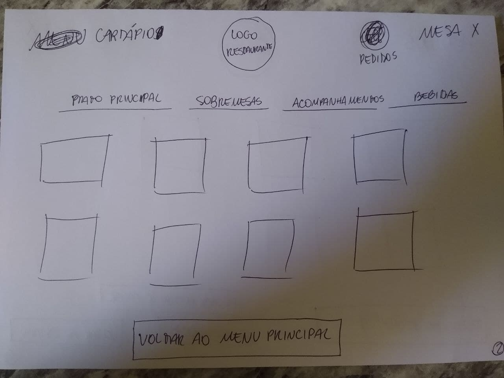
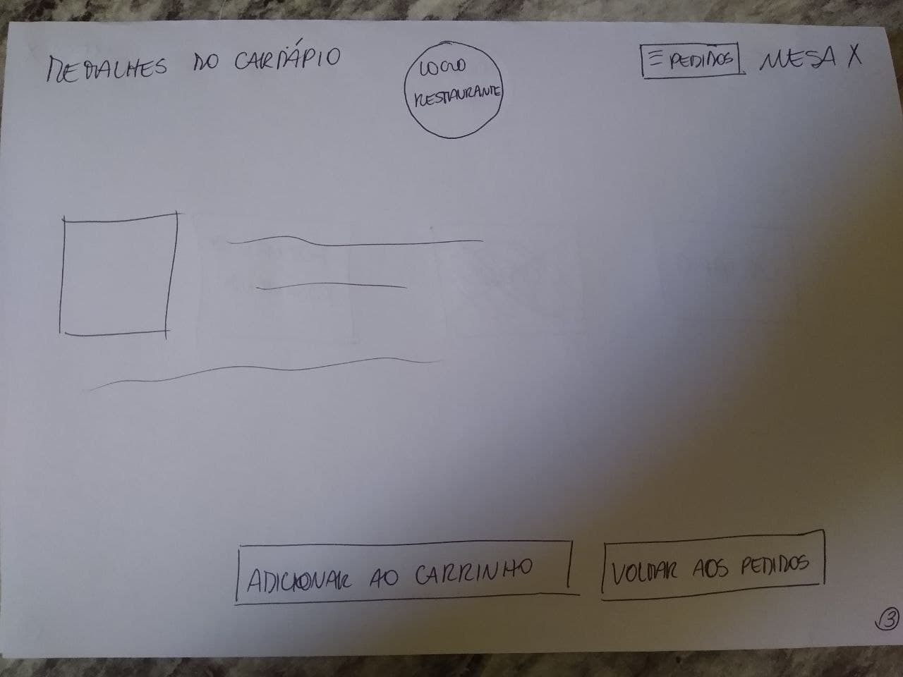
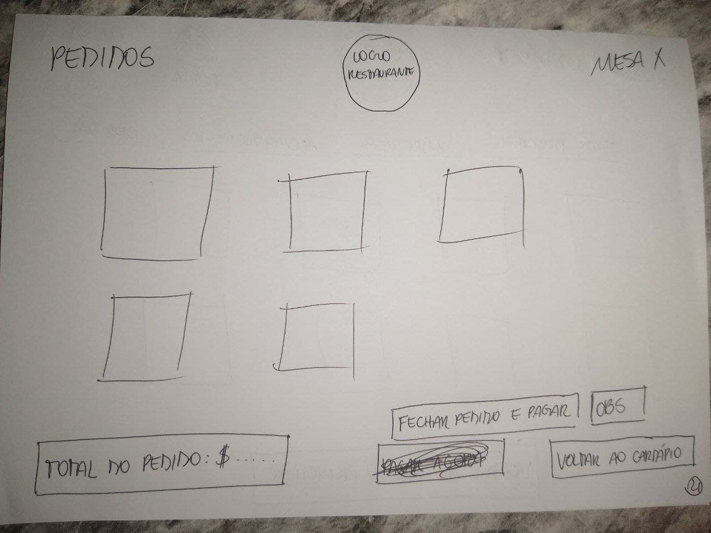
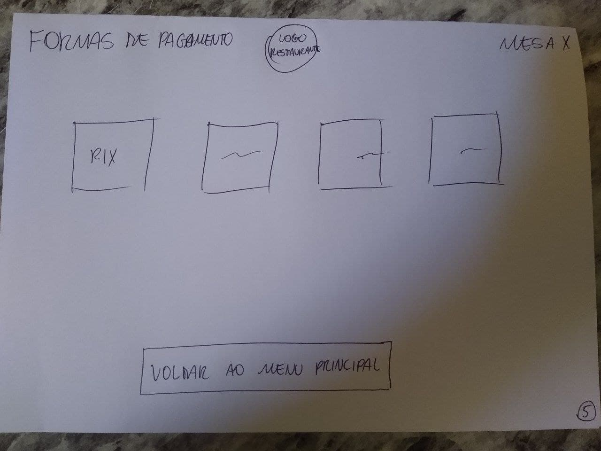
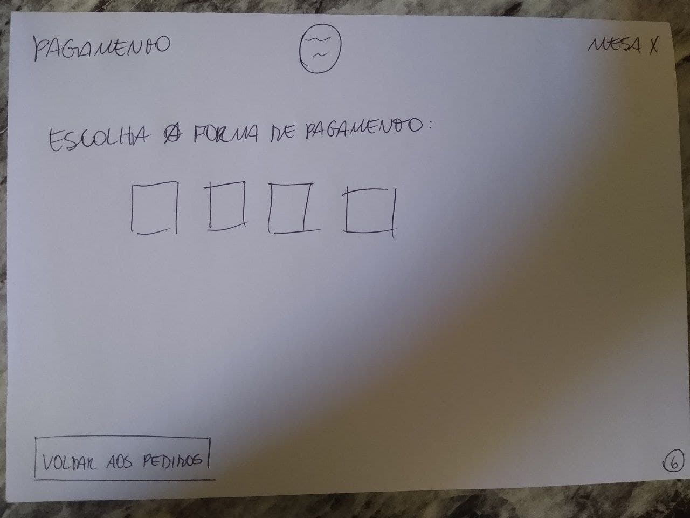
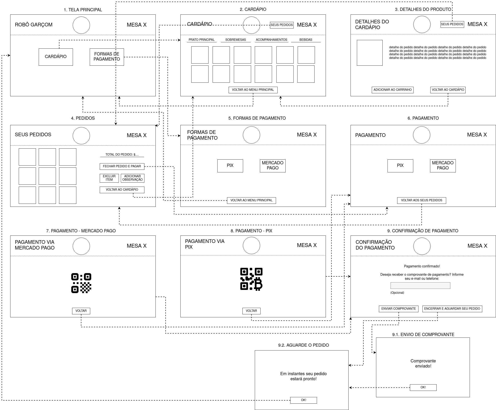

# 
 PROTÓTIPO DE BAIXA FIDELIDADE

#### Histórico de versão 

|    Data    | Versão | Descrição | Autor(es)|
| ---------- | ------ | --------- | -------- |
| 16.08.2021 |   0.1  |Criação do documento |Bruna Almeida|
| 17.08.2021 |   0.2  |Adiciona objetivo do documento|Damarcones porto|
| 18.08.2021 |   0.3  |Adiciona imagens dos protótipos|Bruna Almeida|
 

### Objetivo do documento

O objetivo da criação do protótipo de baixa fidelidade é a apresentação das telas e elementos de uma forma não tão próxima com o produto final. Essa prática permite a discussão sobre detalhes mais superficiais no momento das tomadas de decisão a respeito do design do software e a identificação de possíveis problemas de usabilidade e requisitos.
 
O design das telas do sistema foi discutido em reunião com a equipe de software, em que todos deram seu ponto de vista acerca dos pontos iniciais da interface do produto em termos visuais e estéticos, e os aspectos básicos da experiência do usuário.
  

## Protótipo de baixa fidelidade

 
<figcaption align='center'>
    <b>Figura 1 - Tela inicial.</b>
</figcaption>
 

 
<figcaption align='center'>
    <b>Figura 2 - Cardápio.</b>
</figcaption>
 

 
<figcaption align='center'>
    <b>Figura 3 - Detalhes de um item do cardápio.</b>
</figcaption>
 

 
<figcaption align='center'>
    <b>Figura 4 - Pedidos.</b>
</figcaption>
 

 
<figcaption align='center'>
    <b>Figura 5 - Formas de pagamento.</b>
</figcaption>
 

 
<figcaption align='center'>
    <b>Figura 6 - Tela de pagamento.</b>
</figcaption>
 

Após a equipe de software entrar em consenso quanto à aparência das telas, os integrantes da equipe Bruna Almeida e Damarcones Porto desenvolveram uma segunda versão do protótipo de baixa-fidelidade, na plataforma <a href="https://app.diagrams.net/">draw.io</a>, adicionando algumas telas para complementar a navegabilidade do aplicativo.

 

 
<figcaption align='center'>
    <b>Figura 7 - Protótipo de baixa fidelidade desenvolvido no <a href="https://app.diagrams.net/">draw.io</a>.</b>
</figcaption>
 

### Referências

- WIKIPEDIA, <b>MoSCoW method</b>. Disponível em: <a href="http://web.mit.edu/6.813/www/sp17/classes/08-prototyping/">web.mit.edu/6.813/www/sp17/classes/08-prototyping/</a>. Acesso em 17 de agosto de 2021.