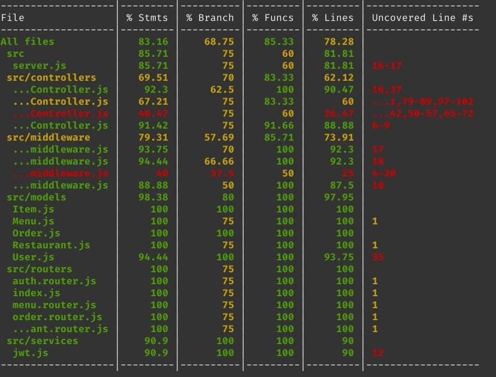

# 
 TESTES

#### Histórico de versão 

|    Data    | Versão | Descrição | Autor(es)|
| ---------- | ------ | --------- | -------- |
| 18.10.2021 |   0.1  |Criação do documento|Bruna Almeida|
| 25.10.2021 |   0.2  |Adição do relatório de testes|Bruna Almeida|
 

A equipe optou por aplicar testes unitários para validar parte do código do <i>software</i> do Robô Garçom. Teste unitário, ou de unidade, é um método onde testa-se unidades menores de um <i>software</i>, de modo isolado, para ver se todas funcionam adequadamente. O <i>backend</i> foi escolhido para passar por esses testes.
 
Os <i>endpoints</i> do <i>backend</i> foram testados, como se fossem uma espécie de <i>“black-box”</i>, para assegurar que o sistema está respondendo como esperado. <i>“Black-box”</i> refere-se ao teste de caixa preta, cujo objetivo é validar as entradas e saídas do sistema, aumentando a qualidade e, consequentemente, blindando o <i>software</i> de falhas.
 

  
### Relatório de testes

O relatório dos testes, apresentado na imagem a seguir, aponta um grau de aceitação por volta de 90% em todo o código escrito para o <i>backend</i> até o momento, indicando uma robustez do sistema como um todo, minimizando as chances de ocorrerem falhas que impeçam o devido funcionamento da aplicação.

 

</ 
<figcaption align='center'>
    <b>Figura 1 - Relatório de testes no <i>backend</i> do sistema. Fonte: autores.</b>
</figcaption>
 

